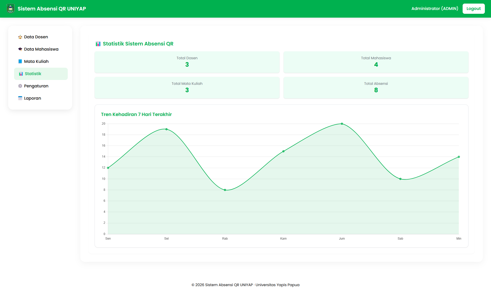
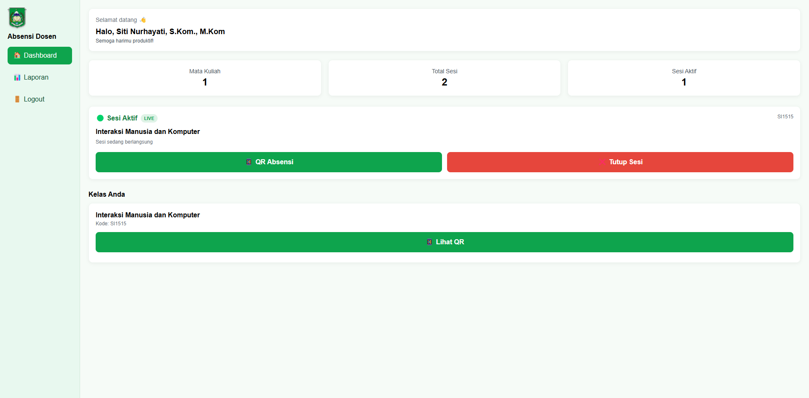
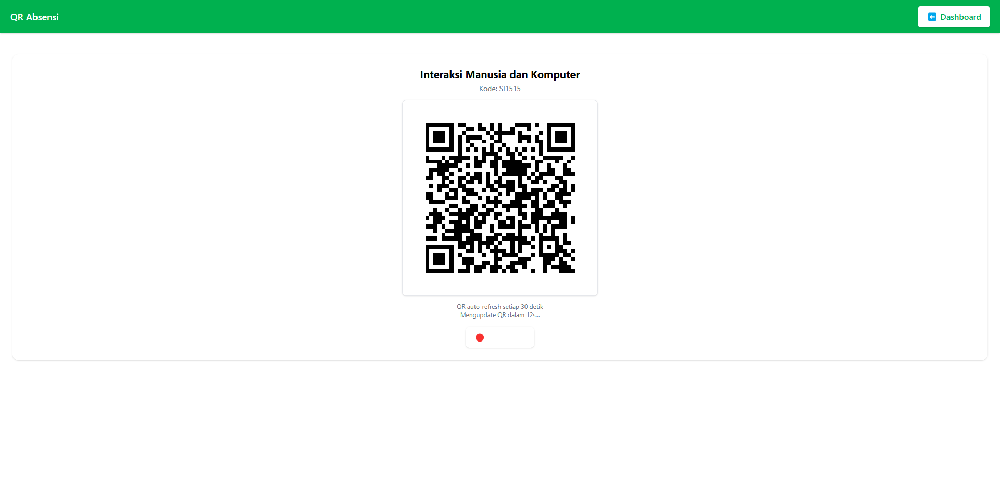
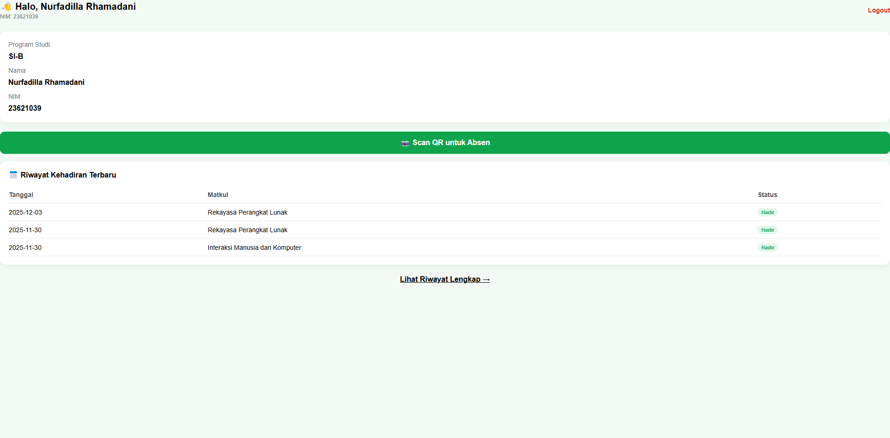
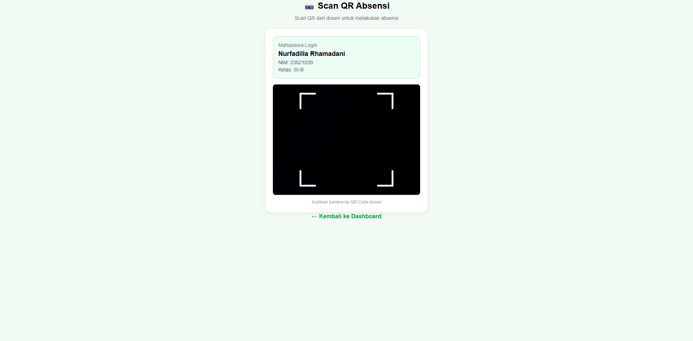

# 🎓 UNIYAP Smart Attendance

Realtime QR Attendance System for Campus built using Express.js, Prisma ORM, Supabase PostgreSQL, Socket.IO, EJS, and TailwindCSS.

---

## 🌐 Live Demo

🔗 https://uniyap-smart-attendance-production.up.railway.app

---

## ✨ Features

- ✅ Multi Role Authentication
- ✅ QR Code Attendance
- ✅ Dynamic QR Generator
- ✅ Realtime Attendance Monitoring
- ✅ Student QR Scanner
- ✅ Attendance Reports
- ✅ Export Excel Reports
- ✅ Dashboard Analytics
- ✅ Admin Management System
- ✅ Lecturer Dashboard
- ✅ Anti Proxy Attendance

---

## 🛠 Tech Stack

- Express.js
- Prisma ORM
- Supabase PostgreSQL
- Socket.IO
- EJS
- TailwindCSS
- ExcelJS
- JWT Authentication

---

## 🖥️ Screenshots

### 🏠 Landing Page


---

### 🔐 Admin Login


---

### 📊 Admin Dashboard



---

### 👨‍🏫 Lecturer Login


---

### 👨‍🏫 Lecturer Dashboard



---

### 📱 QR Attendance Session



---

### 🎓 Student Login


---

### 🎓 Student Dashboard



---

### 📷 QR Scanner



---

## 🚀 Installation

```bash
git clone https://github.com/kptncici/uniyap-smart-attendance.git

cd uniyap-smart-attendance

npm install
```

---

## ⚙️ Environment Variables

Create `.env` file:

```env
DATABASE_URL=
JWT_SECRET=
PORT=3000
NODE_ENV=development
```

---

## ▶️ Run Project

```bash
npm run dev
```

---

## 👨‍💻 Developer

Developed by **NURFADILLA RHAMADANI**
